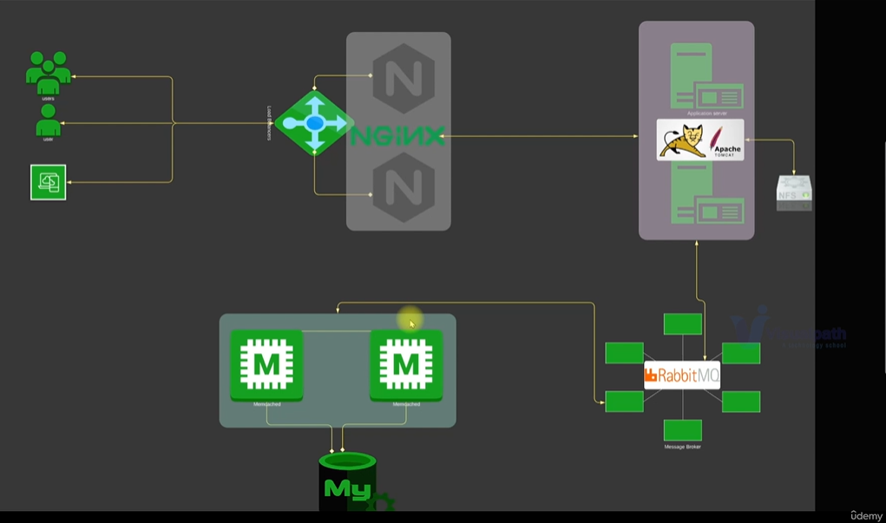

# AWS Lift-and-Shift Application Deployment (vProfile)

This project demonstrates a Lift-and-Shift migration strategy by deploying the multi-tier vProfile application from a traditional virtualized environment to AWS cloud infrastructure.

The goal of this project is to simulate a production-style AWS deployment using Infrastructure-as-a-Service principles and core AWS services such as EC2, S3, Route 53, Load Balancer, and Auto Scaling.

---

## Project Objective

The objective of this project is to:

• Migrate an existing application stack from on-premise environment to AWS  
• Implement scalable infrastructure using AWS services  
• Improve flexibility using elastic cloud architecture  
• Reduce infrastructure management complexity  
• Enable high availability using Load Balancer and Auto Scaling  
• Implement private DNS architecture using Route 53  
• Store application artifacts using S3  
• Prepare infrastructure for automation and Infrastructure-as-Code

---

## Architecture Diagram

## Application Architecture

The application follows a multi-tier architecture:

Frontend Layer:
Application Load Balancer (HTTPS)

Application Layer:
Apache Tomcat running vProfile application

Backend Layer:
MySQL
Memcached
RabbitMQ

Supporting Services:
Route 53 Private DNS
S3 Artifact Storage
IAM
Security Groups

---

## AWS Services Used

Compute:
Amazon EC2

Storage:
Amazon S3
Amazon EBS

Networking:
Security Groups
Application Load Balancer

DNS:
Amazon Route 53 (Private Hosted Zone)

Security:
IAM

Scaling:
Auto Scaling Group

---

## Architecture Workflow

• Users access application load balancer endpoint. The load balancer is in a security group and only allows HTTPS traffic. Then the ALB routes the request to Tomcat instances. 

• Apache Tomcat services run on a set of EC2 instances, which are managed by the auto scaling group. Depending on the load, the instances capacity is scaled out or scaled in. These EC2 instances (running tomcat) are in a separate security group and only allow traffic on port 8080 from the load balancer.

• Information of backend services or backend server IP address is mentioned in Route 53 private DNS zone.

• So, tomcat instances access backend server with a name in Route 53 private DNS where the private IP address of the backend services is mentioned. These backend EC2 instances that run MySQL, RabbitMQ, Memcache are in a separate security group. 

---

## Lift-and-Shift Strategy Explained

Lift-and-Shift means migrating an application from an on-premise environment to cloud infrastructure without modifying application architecture.

Original Deployment:

Local VMs using:
Nginx
Apache Tomcat
MySQL
Memcached
RabbitMQ

New Deployment:

AWS Cloud using:
EC2 Instances
Application Load Balancer
Route 53
S3 Storage
Auto Scaling

This approach minimizes migration complexity and speeds up cloud adoption.

---

## Execution Flow

1. Login to AWS account.
2. Create key pairs.
3. Create security groups for load balancer, tomcat and backend services.
4. Launch instances with user data (bashscripts)
5. Update IP to name mapping in Route 53.
6. Build application from source code (local).
7. Upload to S3 bucket.
8. From S3 bucket, download artifact to tomcat EC2 instance.
9. Setup ELB with HTTPS connection through certificate from ACM (optional).
10. Map ELB endpoint to website name in GoDaddy DNS (optional).
11. Verify the setup.
12. Build autoscaling group for tomcat instances.

---

## Security Design

Three Security Groups were created:

Load Balancer Security Group
Allows HTTPS traffic from internet

Tomcat Security Group
Allows port 8080 access from Load Balancer only

Backend Services Security Group
Allows database/cache/message broker access from Tomcat instances only

This ensures secure tier-based communication architecture.

---

## Artifact Deployment Strategy

Application artifacts are:

Built locally
Uploaded to S3 bucket
Downloaded into Tomcat EC2 instances
Deployed inside application container

This simulates a production deployment workflow.

---

## Project Benefits

Flexible infrastructure

Pay-as-you-go pricing model

Improved scalability

Reduced operational complexity

Cloud-ready architecture

Foundation for Infrastructure-as-Code automation
